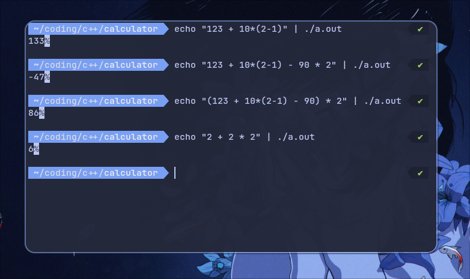

# calculator-milov-dk

Репозиторий, содержащий программу, написанную на языке C, вычисляющую арифметические выражения следующего вида:

- Числа, составляющие входное выражение -- целые
- Допустимые операции: ```+```, ```-```, ```*```, ```/```, а также выражения могут содержать скобки ```()``` 
- На протяжении всего времени работы программы размер чисел не превышает тот, что помещается в тип ```int```

### Алгоритм

В качестве алгоритма парсинга было решено выбрать [Алгоритм сортировочной станции](https://en.wikipedia.org/wiki/Shunting_yard_algorithm) (shunting yard algorithm)

Основная идея его состоит в том, чтобы преобразовать входную строку-выражение в инфиксной форме в выражение в обратной польской записи, более удобное для подсчётов. Делается это при помощи стека, содержащего прочитанные операции(числа из входа сразу идут в выходную очередь).


### Запуск программы

Программа не имеет сторонних зависимостей, кроме ```libc```, поэтому для её сборки необходимо просто выполнить команду
```bash
gcc main.c -o calc.exe
```

Для использования программы необходимо, чтобы ввод заканчивался на EOF. Для этого удобно воспользоваться ```echo```
Пример:
```bash
echo "123 + 10*(2-1)" | ./calc.exe
```
В результате программа выведет ответ в stdout:
```bash
133
```

### Примеры работы


