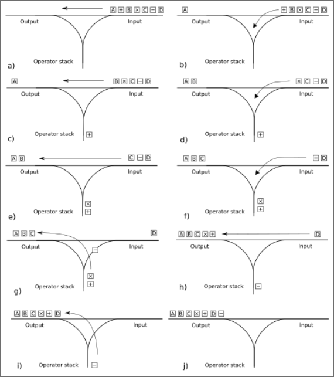

# calculator-milov-dk

## Описание проделаанной работы
### Результаты
В ходе работы был создан калькулятор, отвечающий следующим критериям:
- получение данных из ```stdin```
- вывод ответа в ```stdout```
- корректная работа для входных данных объёмом менее 1KiB
- работа с выражениями в алфавите ```[0-9()*+/-]```(также разрешены пробельные символы: ```\n,\f,\t,\v,\r```)
- обработка ошибок ввода выражения(возвращение ненулевого кода ошибки)
- поддержка ввода, состоящего из целых чисел в промежутке от 0 до 
$2\times10^9$
- корректно работает для всех выражений, в которых каждый результат промежуточных вычислений(в любом из доступных порядков вычисления) находится в пределах $[-2\times10^9\dots+2\times10^9]$ (иначе ```UB```)
- поддержка флага ```--float``` для переключения калькулютора в режим вычислений с плавающей точкой
- в целочисленном режиме деление целочисленное
- в режиме с плавающей точкой деление дробное и точность ответа составляет $10^{-4}$


### Алгоритм


В качестве алгоритма парсинга было решено выбрать [Алгоритм сортировочной станции](https://en.wikipedia.org/wiki/Shunting_yard_algorithm) (shunting yard algorithm)

Основная идея его состоит в том, чтобы преобразовать входную строку-выражение в инфиксной форме в выражение в обратной польской записи, более удобное для подсчётов. Делается это при помощи стека, содержащего прочитанные операции(числа из входа сразу идут в выходную очередь).


### Запуск программы

Программа не имеет сторонних зависимостей, кроме ```libc```, поэтому для её сборки необходимо просто выполнить команду
```bash
gcc main.c -o calc.exe
```

Для использования программы необходимо, чтобы ввод заканчивался на EOF. Для этого удобно воспользоваться ```echo```
Пример:
```bash
echo "123 + 10*(2-1)" | ./calc.exe
```
В результате программа выведет ответ в stdout:
```bash
133
```

### Примеры работы

